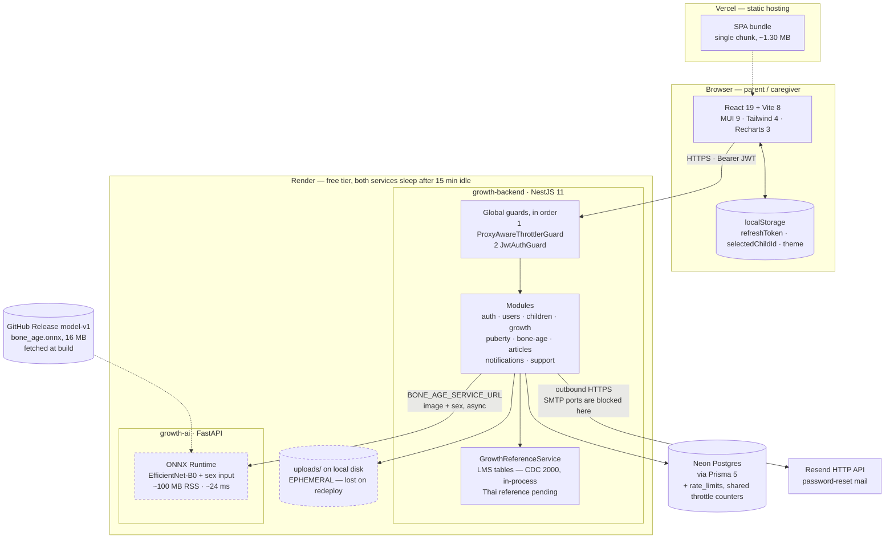
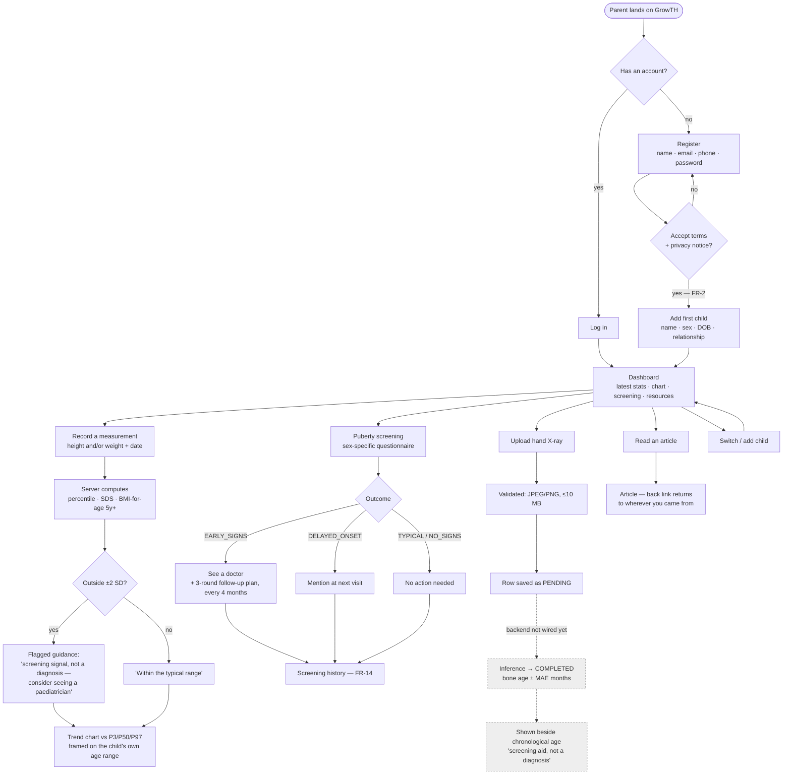

# GrowTH — System Diagrams

Mermaid source for the three project diagrams. These describe the system **as built**
(updated 2026-08-18), not the original proposal — where the two differ, the difference is
called out.

Rendered exports, regenerated from this file:

| Diagram | SVG |
| --- | --- |
| System architecture | [`diagram-system-architecture.svg`](./diagram-system-architecture.svg) |
| App structure | [`diagram-app-structure.svg`](./diagram-app-structure.svg) |
| User flow | [`diagram-user-flow.svg`](./diagram-user-flow.svg) |

```bash
npx -y @mermaid-js/mermaid-cli -i docs/diagrams.md -o docs/diagram.svg -b white
```

> The earlier exports `app-overview-diagram.svg/png` and `system-architecture.svg/png` were
> deleted on 2026-08-18. They pre-dated the ai-service, the rate limiter and the auth changes,
> and a stale architecture diagram is worse than none — someone reads it and believes it.

---

## 1. System Architecture



**Notes on what this shows**

- **Auth** — 15-minute access JWT in memory; refresh token is 48 random bytes, stored
  SHA-256-hashed in `sessions`, and rotated on every use. Only the refresh token touches
  `localStorage`.
- **Guard order matters.** The throttler runs before `JwtAuthGuard`, so a credential flood is
  rejected before it costs a passport verify and a bcrypt compare. Its counters live in
  Postgres, not in the process — Render serves more than one instance, and per-process tallies
  multiplied the limit by the instance count.
- **Percentile maths runs in-process**, not in the database and not in a service — the LMS
  tables are JSON bundled with the API. They are currently **CDC 2000 (US)**; the Thai
  reference swap is pending (see `research-checklist.md` §D1).
- **The model is not in the repo.** `bone_age.onnx` is a GitHub Release asset that
  `growth-ai` fetches at build time. A 16 MB binary in git would be carried by every clone
  forever and duplicated on each retrain.
- **ONNX, not torch.** torch needs 635 MB on disk and 374 MB resident, which does not fit a
  512 MB instance alongside uvicorn. ONNX Runtime is ~100 MB at ~24 ms per inference and
  matches torch to 3e-06.
- **Two dashed boxes are the remaining gaps**: `growth-ai` is deployed but **uncalibrated** —
  the checkpoint's training target was normalised, so it needs `AGE_MEAN`/`AGE_STD` from the
  training run before it will return months, and refuses to guess until then. And Render's
  disk does not survive a redeploy, so uploaded X-rays outlive their files.

---

## 2. App structure — routes and layout

```mermaid
flowchart TD
    ROOT["/ HomeRoute"] -->|"signed in"| DASH_R["redirect → /dashboard"]
    ROOT -->|"signed out"| HOME["Home — PublicHeader + Footer"]

    subgraph pub["Public routes — no session required"]
        HOME
        ABOUT["/about"]
        CONTACT["/contact"]
        LOGIN["/login"]
        REG["/register"]
        FORGOT["/forgot-password"]
        RESET["/reset-password"]
        PRIV["/privacy"]
        LEARN["/learn"]
        ART["/learn/:id"]
        NF["* → NotFound"]
    end

    subgraph prot["ProtectedRoute — redirects to / when signed out"]
        ADDCHILD["/children/new<br/>/children/:id/edit<br/>(no AppShell — focused task)"]
        subgraph shell["AppShell — top nav + mobile bottom nav + footer"]
            DASH["/dashboard"]
            GROWTH["/growth"]
            PUB["/puberty"]
            BONE["/bone-age"]
            CHILDREN["/children"]
            NOTIF["/notifications"]
            PROFILE["/profile"]
            SETTINGS["/settings"]
            MILE["/milestones — Placeholder"]
            HELP["/help — Placeholder"]
        end
    end

    LEARN --> ART
    ART -->|"back, via router state"| HOME
    ART -->|"back, via router state"| DASH
    ART -->|"back, fallback"| LEARN

    classDef dead fill:#eee,stroke:#999,stroke-dasharray: 4 3
    class MILE,HELP dead
```



**Notes**

- `/learn` and `/contact` sit **outside** `ProtectedRoute` but re-enter the app chrome via
  `PageChrome` when a session exists — so a signed-in reader keeps the nav instead of
  appearing logged out.
- `ArticleDetail`'s back link follows router state stamped by `ArticleCard`, so it returns
  to Home, Dashboard or Learn depending on where the reader came from. It used to be
  hardcoded to `/learn`.
- **`/milestones` and `/help` are dead** (greyed above): both render a "Coming soon"
  placeholder and neither appears in any navigation — unreachable except by typing the URL.

---

## 3. User flow



**Notes**

- The **terms gate is enforced server-side** (`@Equals(true)` on the register DTO), not just
  in the form — FR-2.
- Every clinical-looking output is worded as a screening signal. No path in this flow
  produces anything phrased as a diagnosis.
- The dashed branch is the bone-age prediction. Upload, validation and history all work today,
  and the `growth-ai` service is deployed and serving. Two things remain: the backend does not
  yet call it (`BONE_AGE_SERVICE_URL` unset), and the model is uncalibrated — it cannot convert
  its raw output to months until `AGE_MEAN`/`AGE_STD` arrive from the training run. It returns
  503 rather than fabricating a value. See `ai-integration.md`.

---

## Rendering these

GitHub renders Mermaid in Markdown natively. For standalone files:

```bash
npx -y @mermaid-js/mermaid-cli -i docs/diagrams.md -o docs/diagrams.svg
```
